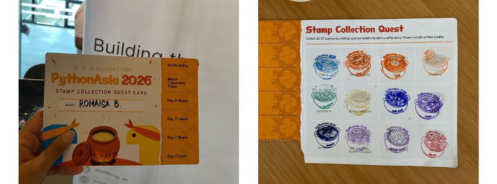
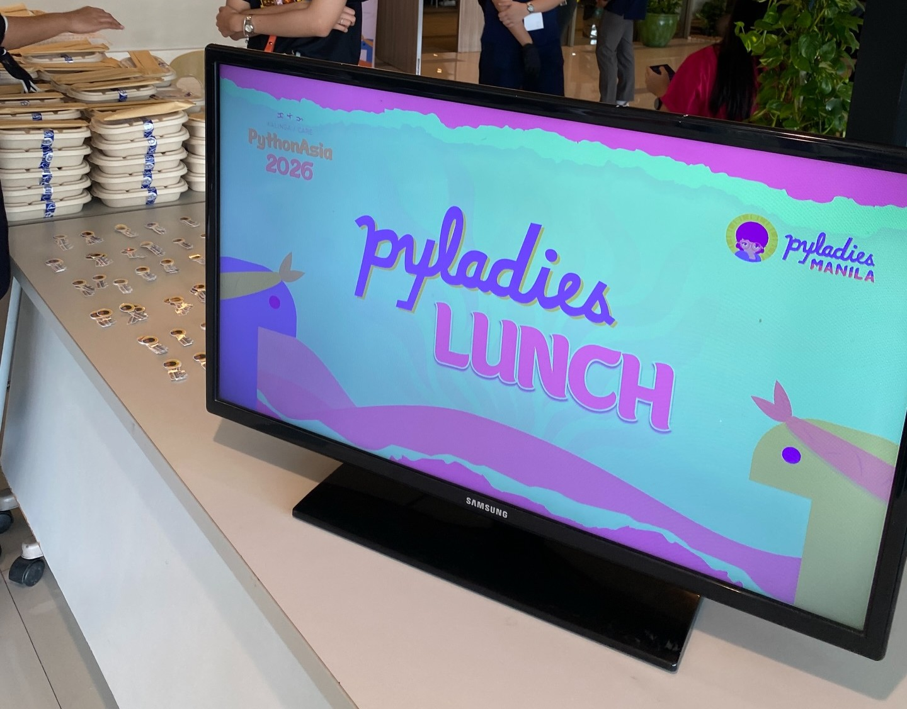
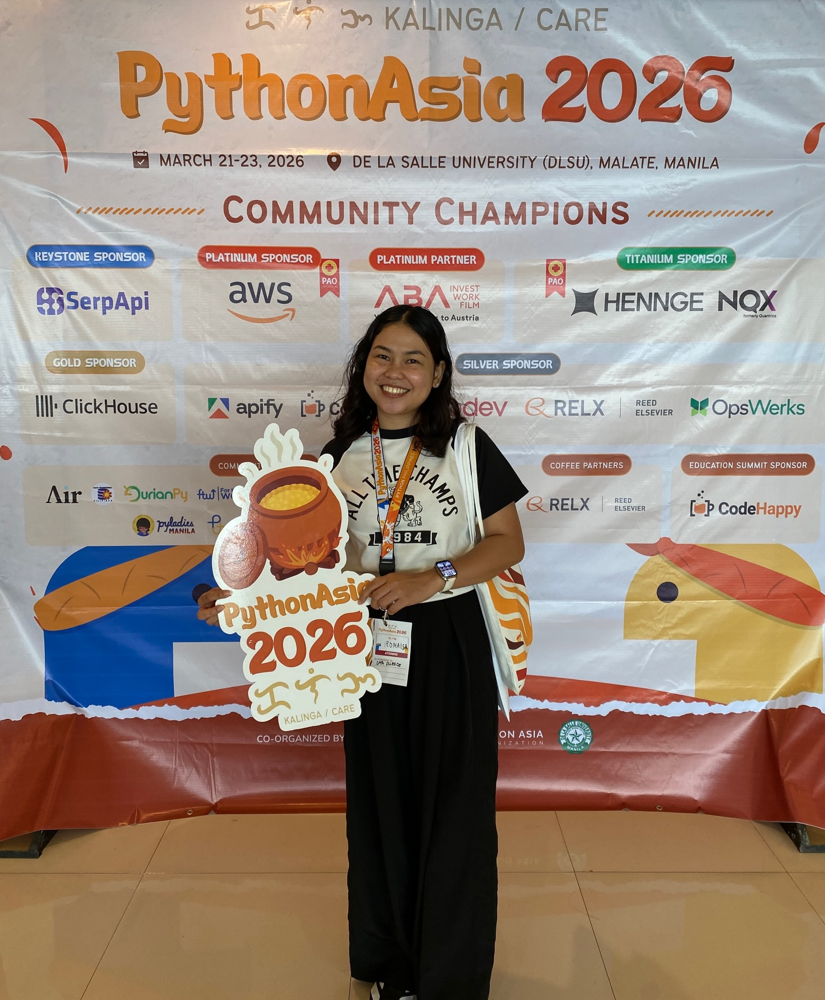

*Almost, but not quite.*

There are times when you can't stay still, have to look around and just do something for the sake of being sane. This is one of those moments for me. I'd already been accepted into UP Diliman in the Technology Management program, but something at the back of my mind is telling me, *this isn't it.*

I kept searching the internet, thinking back and forth: should I get Computer Science? Economics? Something else entirely? I couldn't pinpoint exactly what I wanted to do in the future.

And then I found Data Science.

I got accepted into a university in early February 2026, so I figured it was time to get serious and prepare for the coursework *(more on this in upcoming posts, I haven't started studies yet)*. I read on forums and Reddit subs that you at least need to be good at Python. I thought, *that will screw me up.* 

My Python skills were nearly non-existent... my only encounter with it was a 40-minute online coding workshop hosted by DICT. At most, I had surface-level knowledge of tools like Python, SQL, HTML, CSS, and JavaScript from part-timing as a web designer. R, Power BI, Colab, and Tableau were complete strangers to me.

So I went looking for nearby Python community events, and thankfully I'm lucky. In just a month, **PythonAsia 2026** would be held at De La Salle University Manila.

<!--more-->

## About PythonAsia

[PythonAsia 2026](https://2026.pythonasia.org "PythonAsia website") is the same spirit as PyCon APAC, just under a new name. The official theme was **Kalinga**, it is a Filipino word for *care* and means nurturing a community with compassion and growth. The event campaigns and marketing were so well done that I was hooked instantly. Here's the Stamp Collection Quest Card:

One talk that stayed with me was **Jay Miller's** keynote, *"Building Legendary Communities Through Experiences Beyond The Walls."* It was the best way to start the conference, reminding me that  isn't just about Python or coding, you also have to build real connections with the people around you. He talked about ways to initiate a conversation,  inviting people to dinners outside the event, and FOOD. Because food is what connects us all.

*I would really like to apply it all but at the time I didn't feel confident enough yet. Everyone seemed like they'd come with their own company or group. But, that's not to say I didn't talk to all over the two days I was there. I did, but I can do better :)*

I also caught **Gertrude Abagale's** talk about PyLadies, a space specifically for women, along with the PyLadies Lunch networking event. I love that niche communities like this exist. I even got some cute stickers from them, which now live proudly on my iPad.

## Data Problems Are Real Problems

One of my favorite sessions was **Michael Onasis S. Ogbinar's** talk, *"Philippines Through Data (Python)."* This one really resonated with me on Data Analysis and Data Science. It touched on Sustainable Development Goals, missing values in Philippine government data, proxy data, and data governance. It was meant to be a hands-on workshop with VS Code, but poor planning on my part - I only brought an iPad. I'm hoping to complete the activity properly one of these days. *(Someone help me shoo away the procrastination.)*

The speaker also gave this advice:

> *Solve problems that you care about.*

It felt exactly what I needed to hear. He talked about how it's tempting to copy Kaggle notebooks just to have something for your CV, but building projects tied to your own questions and your own life will always be the stronger portfolio.

## New Tools to Learn

The conference handed me a long list of tools to look into. Honestly, there were so many that I felt like I couldn't even grasp half of what the conference was about.

Here's what I jotted down in my notes:

- Kaggle
- Quarto
- Marimo
- Docker
- Apify
- Pretalx
- DuckDB
- Polars
- MongoDB
- MotherDuck
- Astral UV

I'm not even sure I should look into all of these. My mind already feels near-full just diving into Python, VS Code, and GitHub - I'm not sure there's room for much more. But maybe that's okay?

What matters, I think, is *seeing the shape of the ecosystem*. Like I'd really love to learn Marimo right now, but I haven't even gotten comfortable with VS Code and Colab yet. I'm at the point realizing Python isn't just one language sitting alone, it connects to notebooks, databases, APIs, analytics engines, containers, dashboards, and workflows.

It made my field of view feel both *bigger* and *approachable* at the same time. Bigger, because there's so much to learn. More approachable, because each tool points to a specific kind of problem. For now, awareness is enough, at least I'll know these tools exist when I actually need them.

## AI Talks

Would you believe I didn't know ChatGPT, Perplexity, Claude, DeepSeek, and Copilot are all called **LLMs**? I felt so dumb, honestly. I'd only ever referred to them collectively as "AIs." Good news for me, no one noticed and I picked up more context as the talks went on.

**Charibeth Cheng's** keynote on cultural sensitivity in localized LLMs got me thinking about language, context, and just how difficult it is for AI systems to grasp nuance. I doubt I'm the only one who's had Claude or ChatGPT drift off-topic or completely miss local slang.

There was also a fascinating talk by **Petr Andreev** on how high-performance chips are manufactured. Chips and fabs are endlessly interesting to me - like, *how* do we humans actually engineer connections that microscopic onto a very thin piece of silicon wafer? I  don't understand how that works even to this day.

## Realizations

After the two-day conference, I started thinking seriously about project ideas I could actually work on. *(I had office work on Monday, so I couldn't attend the education summit on day 3.)*

One idea was a tool that analyzes my [personal spending and generates a word cloud of past daily finance expenses](https://gist.github.com/romaisablbgn/65595e7bad7a072192c83a26570783e7) *(I vibe-coded this idea into a Colab notebook)*. Another was a platform comparing an 8% flat tax versus a graduated tax system. I also thought about a project classifying artworks, films, or dramas by historical period since I'm so into cdramas lately.

The ideas are rough as it is but that's exactly what makes them more exciting than just following a tutorial without understanding *why* I'm doing it.

I also wrote down a list of statistics topics I need to study more seriously:

- descriptive statistics
- linear regression
- logistic regression
- R-square

One more piece of advice from the conference has stuck with me:

> *When burned out, go back to basics. Remove the noise.*

That feels like exactly the right instruction for where I am right now.

There are so many tools, podcasts, frameworks, and roadmaps out there that it's easy to feel behind before you've even begun. But maybe the better path is simpler: *learn the basics, build small projects, write about what I understand, and keep going.*

PythonAsia 2026 made me feel like I could **begin**.

I'm more than happy to have been part of PythonAsia 2026 Manila. 

Here's to hoping I get the chance to join future PythonAsia conferences too.

Signing off,

Roma